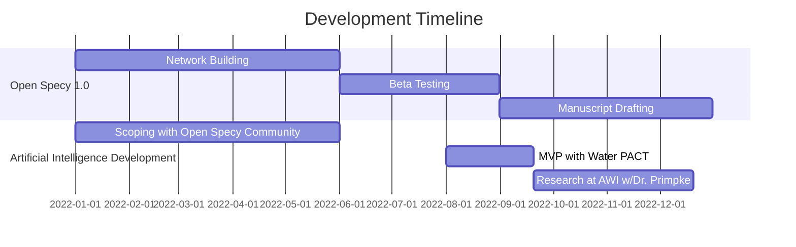

# Open Specy Shiny App
Welcome to the new home for the Open Specy web application. If you are looking for the R package go to [OpenSpecy-package](https://github.com/wincowgerDEV/OpenSpecy-package)

<!-- badges: start -->
<!--

-->

<!-- badges: end -->

## Connect
If you want to discuss anything with the community you can start a conversation on [Gitter](https://gitter.im/Open-Specy/community?utm_source=badge&utm_medium=badge&utm_campaign=pr-badge))

## Contributing
Contributions of all kinds are welcome!

Some ideas on [How to Contribute](https://opensource.guide/how-to-contribute/). 

Please adhere to this project's [Code of Conduct](https://www.contributor-covenant.org/version/2/1/code_of_conduct/).

## Installation
### Data
If you are looking for the most up to date dataset for the Open Specy library see [/data](https://github.com/wincowgerDEV/OpenSpecy-shiny/tree/main/data)

### Software

## Roadmap

